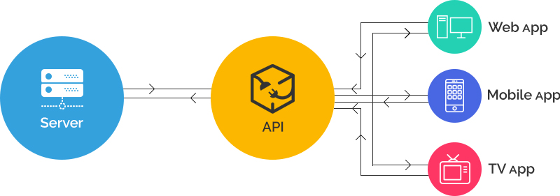
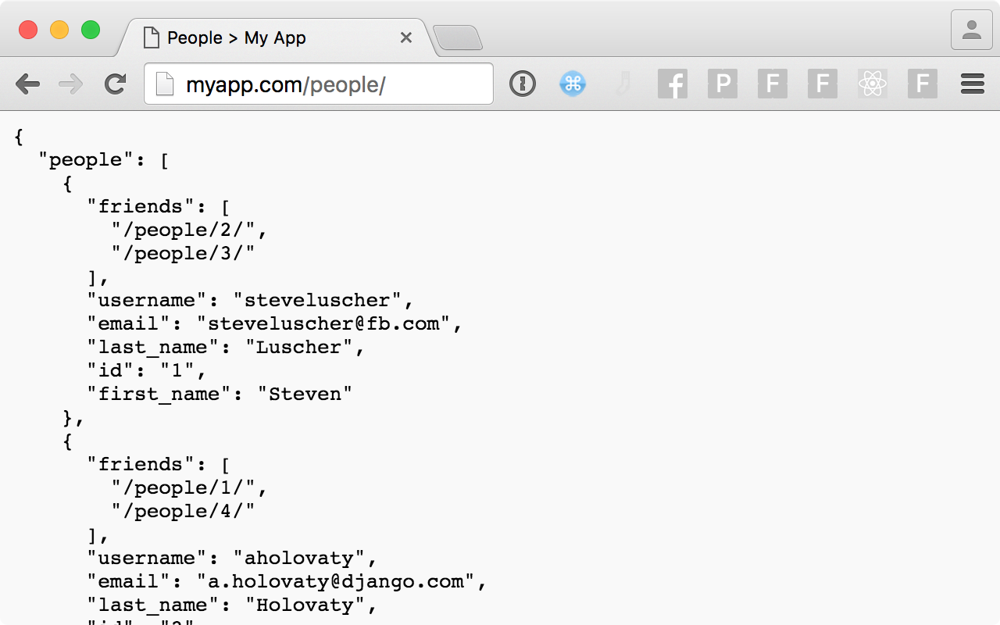
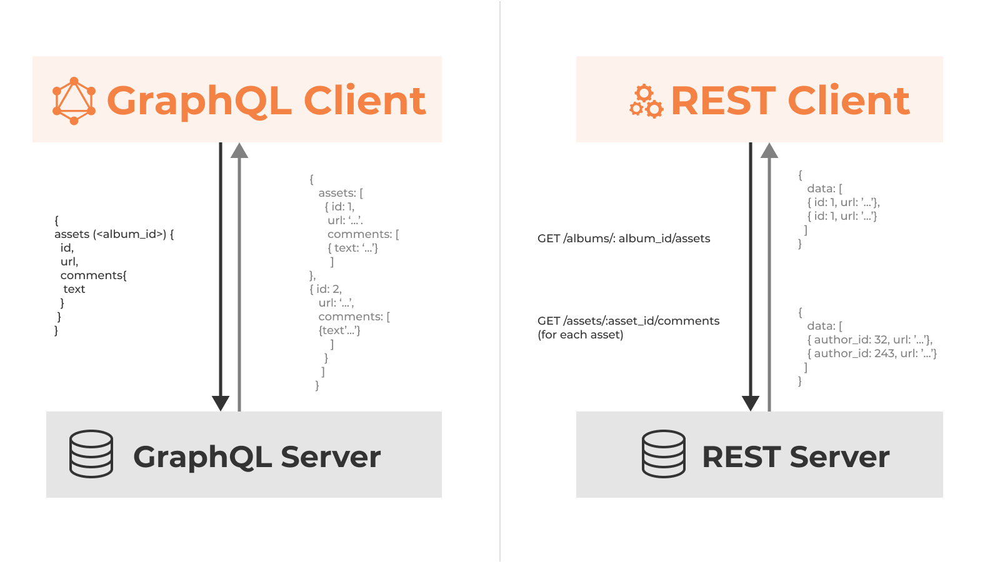

# Documentation for my first steps with GraphQL.

## Previous Requirements

-Understandings of CSS, JS and a modern JS framework such as React.

-Core principals of deployment, APIs, and general web-development tools and practices.

Feel free to join the discussions, and to contribute to any of my repos, please use 2 tabs ;).

Before we embark on what is at least to me now an extended amount of text and data to process, I'd like to clarify that I'm open to debate and conversation with the claims I make in my docs, programming is a team effort and I made this public with the aim of having people who know things I don't contribute and enrich our collective knowledge. I read things online and work as a developer in that order, and form my knowledge of these techs as I go, I like to be straight forward and I hope my code runs, if there are any questions I'd love to hop on a call and see what you're working on.

#### TLDR: I'm open to discussion with your opinion on my code and stack choice and yours.

#### I use node, react, typescript, graphql and next/vercel.

##### 1 I need to create, store and fetch API values in my project.

##### 2 I want to standarize my front-end value fetching with JSON and plan on handling my data objects with GraphQL.

##### 2 I'd like for this guide to be as short, readable and correct as possible.

### Lets embark on Ben's journey through graphQL:

[mongogql](mongoql/README.md)
[apolloqlexpress](apolloqlexpress/README.md)

[Playlist](https://www.youtube.com/playlist?list=PLN3n1USn4xlkDk8vPVtgyGG3_1eXYPrW-)

[What is GraphQL](https://youtu.be/G0flJz7Zbvc)

[GraphQL Hello World](https://youtu.be/DyvsMKsEsyE)

[GraphQL Ecosystem](https://youtu.be/VnG7ej56lWw)

[Nodejs and MongoDB GraphQL Server](https://youtu.be/YFkJGEefgU8)

[GraphQL Vs REST](https://youtu.be/AYZOHt6kz6Y)

PS: Thanks [Ben](https://www.youtube.com/channel/UC-8QAzbLcRglXeN_MY9blyw).
